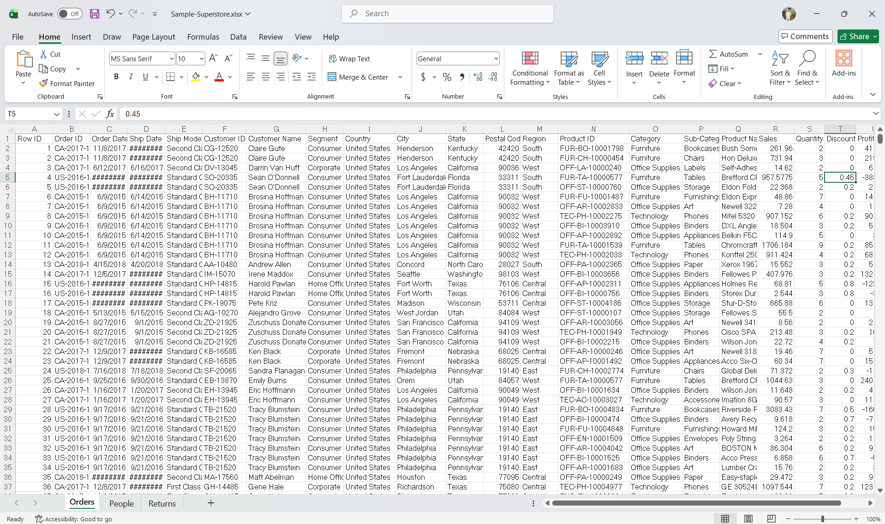
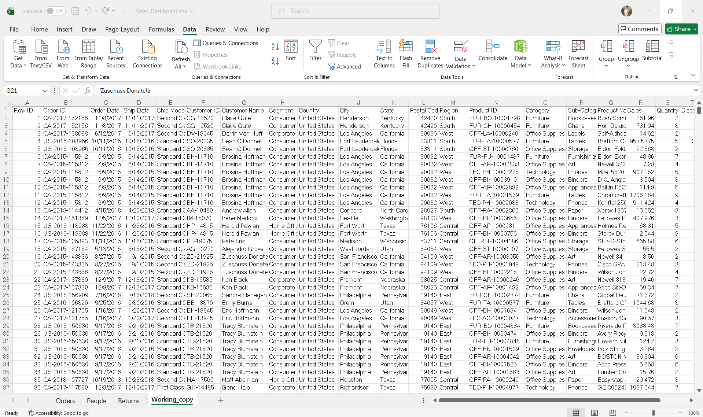
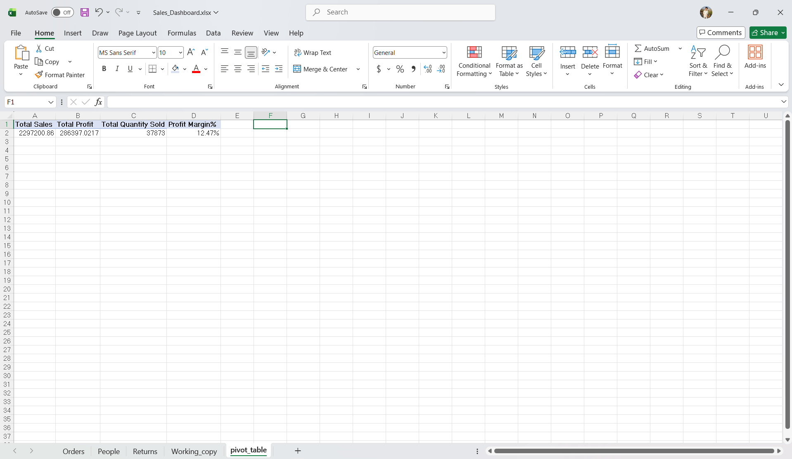
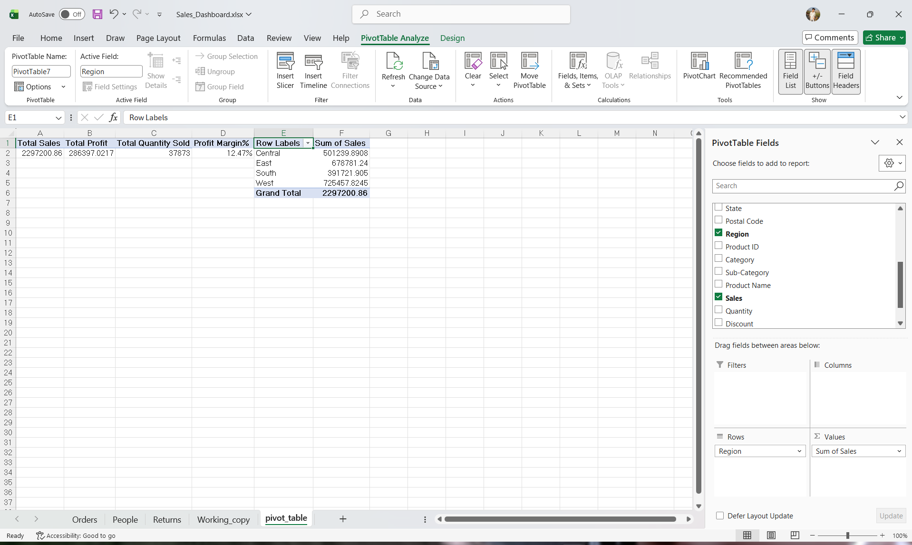
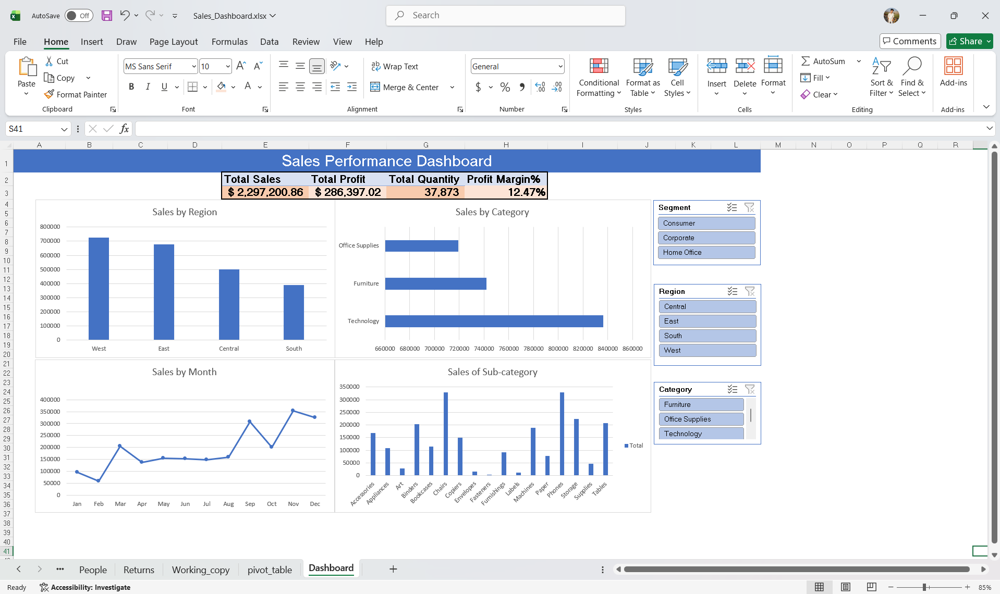

# 📊 Sales Performance Analysis using Microsoft Excel

## Objective

Analyze retail sales data using Microsoft Excel to identify business insights related to sales, profit, customers, products, and regional performance. Build an interactive dashboard using Pivot Tables, Pivot Charts, Slicers, and Excel formulas.

---

## Dataset

- **Dataset:** Sample Superstore
- **Tool Used:** Microsoft Excel
- **Total Records:** 9,994
- **Total Columns:** 21

### Raw Dataset

The project uses the Sample Superstore dataset containing retail sales transactions.



---

## Data Audit

### Dataset Inspection

- Reviewed the dataset structure and identified all available fields.
- Verified that the dataset contains **21 columns** and **9,994 records**.

### Data Display Issues

- Order Date and Ship Date initially displayed as `########`.
- Cause: Column width was insufficient to display the formatted date.
- Resolution: Adjusted the column display so the dates were visible.

### Missing Value Investigation

- Used **Go To Special → Blanks** to identify missing values.
- Found missing values in the **Postal Code** column.
- Investigated the affected records and found that all **11 Burlington, Vermont** records had missing postal codes.
- Since Postal Code was not required for dashboard analysis, the values were left unchanged and documented.

### Duplicate Record Assessment

- Created a separate **Working Copy** of the dataset before performing any cleaning operations.
- Preserved the original dataset to avoid modifying raw data.
- Used **Data → Remove Duplicates**.
- Selected **all 21 columns** to detect only completely identical records.
- **Result:** No duplicate records were found.

### Data Type Verification

The dataset was reviewed to verify that each column had the correct data type before analysis.

| Data Type | Example Columns |
|-----------|-----------------|
| Date | Order Date, Ship Date |
| Text | Order ID, Customer Name, Category, Sub-Category, Region, State, City |
| Numeric | Sales, Profit, Quantity |
| Percentage | Discount |
| Identifier | Postal Code (treated as text) |

### Data Audit Snapshot



---

# Exploratory Data Analysis (EDA)

After completing the data audit, exploratory data analysis was performed to summarize key business metrics before building the dashboard.

The analysis focuses on:

- Overall Sales Performance
- Profitability
- Regional Performance
- Product Performance
- Customer Trends

---

## KPI Planning

The dashboard includes four primary KPIs:

- Total Sales
- Total Profit
- Total Quantity Sold
- Profit Margin (%)

These KPIs provide a quick overview of revenue, profitability, sales volume, and business efficiency.

---

## KPI 1 – Total Sales

A Pivot Table was created to calculate the total sales across all transactions.

### Pivot Configuration

| Area | Field |
|------|-------|
| Values | Sum of Sales |

### Result

**Total Sales:** **$2,297,200.86**

---

## KPI 2 – Total Profit

A Pivot Table was created to calculate the total profit across all transactions.

### Pivot Configuration

| Area | Field |
|------|-------|
| Values | Sum of Profit |

### Result

**Total Profit:** **$286,397.02**

---

## KPI 3 – Total Quantity Sold

A Pivot Table was created to calculate the total quantity of products sold.

### Pivot Configuration

| Area | Field |
|------|-------|
| Values | Sum of Quantity |

### Result

**Total Quantity Sold:** **37,873**

---

## KPI 4 – Profit Margin

Profit Margin was calculated using the following Excel formula:

```excel
=Total Profit / Total Sales
```

### Result

**Profit Margin:** **12.47%**

---

## KPI Summary

| KPI | Result |
|------|-------:|
| Total Sales | $2,297,200.86 |
| Total Profit | $286,397.02 |
| Total Quantity Sold | 37,873 |
| Profit Margin | 12.47% |

These KPIs provide an overall snapshot of business performance.

### KPI Summary Preview



---

# Sales Analysis

## Regional Sales Analysis

A Pivot Table was created to compare sales across different regions.

### Pivot Configuration

| Area | Field |
|------|-------|
| Rows | Region |
| Values | Sum of Sales |

### Key Findings

- West generated the highest sales.
- South generated the lowest sales.
- Sales performance varied significantly across regions.

### Regional Sales Chart



---

## Category Sales Analysis

A Pivot Table was created to compare sales across product categories.

### Pivot Configuration

| Area | Field |
|------|-------|
| Rows | Category |
| Values | Sum of Sales |

### Key Findings

- Technology generated the highest sales.
- Furniture ranked second.
- Office Supplies generated the lowest sales.

---

## Monthly Sales Trend

A Pivot Table was created to analyze monthly sales performance.

### Pivot Configuration

| Area | Field |
|------|-------|
| Rows | Months (Order Date) |
| Values | Sum of Sales |

### Key Findings

- November recorded the highest sales.
- December also showed strong performance.
- February recorded the lowest sales.
- Sales increased significantly during the final quarter of the year.

### Category & Monthly Sales


---

## Sub-Category Sales Analysis

A Pivot Table was created to identify the highest-performing product sub-categories.

### Pivot Configuration

| Area | Field |
|------|-------|
| Rows | Sub-Category |
| Values | Sum of Sales |

### Key Findings

- Phones generated the highest sales.
- Chairs ranked second.
- Storage, Tables and Binders also performed well.
- Fasteners generated the lowest sales.

---

# Dashboard Design

A dedicated dashboard sheet was created using Pivot Tables, Pivot Charts, KPI cards and Slicers.

## Dashboard Components

### KPI Cards

- Total Sales
- Total Profit
- Total Quantity Sold
- Profit Margin

### Pivot Charts

- Sales by Region
- Sales by Category
- Sales by Sub-Category
- Monthly Sales Trend

### Interactive Slicers

- Region
- Category
- Segment

The slicers allow users to dynamically filter the dashboard and analyze business performance from different perspectives.

---

# Dashboard Preview

## Final Interactive Dashboard



---

# Key Business Insights

- Total Sales exceeded **$2.29 Million**.
- Overall Profit Margin was **12.47%**.
- West region generated the highest revenue.
- South region generated the lowest revenue.
- Technology was the best-performing product category.
- Phones generated the highest sales among all sub-categories.
- Sales peaked during November and December.

---

# Excel Features Used

- Pivot Tables
- Pivot Charts
- Slicers
- Excel Formulas
- Data Cleaning
- Data Auditing
- Duplicate Detection
- Missing Value Analysis
- Sorting & Filtering
- Dashboard Design
- KPI Cards
- Number Formatting
- Cell Formatting

---

# Skills Demonstrated

## Data Preparation

- Data Inspection
- Data Cleaning
- Missing Value Analysis
- Duplicate Detection
- Data Validation

## Data Analysis

- Exploratory Data Analysis (EDA)
- KPI Development
- Sales Trend Analysis
- Regional Performance Analysis
- Product Performance Analysis

## Data Visualization

- Pivot Charts
- Interactive Dashboard
- KPI Cards
- Slicers
- Business Reporting

---

# Folder Structure

```text
Sales-Performance-Analysis-using-Microsoft-Excel/
│
├── Dashboard/
│   └── Sales_Performance_Dashboard.xlsx
│
├── Dataset/
│   └── Sample_Superstore.xlsx
│
├── Images/
│   ├── 01_Raw_data.png
│   ├── 02_Data_Audit.png
│   ├── 03_Pivot_summary.png
│   ├── 04_Regional_Sales.png
│   ├── 05_Category&Monthly Sales.png
│   └── 06_Dashboard_with_chart&slices.png
│
└── README.md
```

---

# Project Outcome

This project demonstrates how Microsoft Excel can be used to transform raw retail sales data into an interactive business dashboard.

The dataset was cleaned, validated, analyzed, and visualized using Pivot Tables, Pivot Charts, KPI cards, and Slicers. The final dashboard enables users to explore sales performance by region, category, segment, sub-category, and month, helping support data-driven business decisions.

---

## Author

**Jayant Rajput**

- GitHub: https://github.com/JayantRajpoot
- LinkedIn: https://www.linkedin.com/in/jayantrajpoot/
